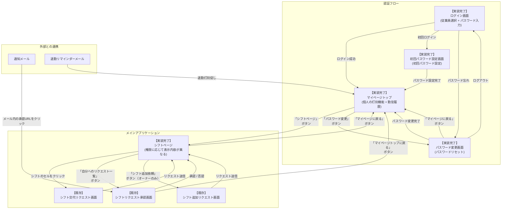

# 勤怠管理チェックアプリ仕様書（Rails版）

## 1. 概要

## 突発的なシフト交代が頻発する小規模飲食店を救う勤怠管理システム！

### 1.1. 技術スタック（Rails移行後）
- **フロントエンド**: HTML/CSS/JavaScript（既存UI維持）
- **バックエンド**: Ruby on Rails 7.0
- **データベース**: PostgreSQL（Heroku）
- **認証**: LINE認証 + カスタム認証システム
- **デプロイ**: Heroku
- **外部API**: Google Sheets API（既存データ連携）、freee API

### 1.2. ターゲットユーザー

- ユーザー想定：学生が多く働いている居酒屋のオーナー・従業員
- グループLINEがあり、そこでシフト交代などの連携をとっている
    - シフト交代成立後は、オーナーが手動でシフト予定を書き換える

### 1.3 抱えている課題

1. 打刻忘れ
    1. 特に、急に入ったシフトの場合に打刻忘れが多い
        
        (繁忙期の「打刻は後でいいから先ドリンク持って行って」的なケース想定)
        
2. **退勤打刻忘れが特に多い**
    - 仕込みで延長することもあり、退勤時刻が不規則になりがち
    - 15分間隔でのリマインダーが必要
    
3. 突発的なシフト変更による、シフト表と実勤務時間の乖離
    1. 事前に決めていたシフトからの変更が多く、「今日のシフトは誰なのか」を確認するために、LINEを遡って正しい勤務時間を追跡する必要があり面倒
    
    → 従業員の遅刻時連絡や、打刻忘れの検知のために必要
    
4. **勤怠時刻修正の手間**
    - オーナーが勤怠時刻を修正するために、管理会社にメールする必要があり面倒
    
5. **認証の複雑さ**
    - パスワード+顔認証の二段階認証が面倒
    - パスワードのみで十分
    

### 1.3. 本アプリが生める価値

- メイン価値
    
    「突発的なシフト交代に対応できる勤怠管理システム」によって、シフト交代時に頻発する打刻忘れを防止、くわえてシフト表が実情を正しく反映できるようにし、スタッフ間での連携もとりやすくする
    
- サブ価値
    
    103万の壁を可視化することによって、計画的な勤務を促し年末の人手不足を解消
    
- **新たな価値**
    
    - 退勤打刻忘れの防止（15分間隔リマインダー）
    - オーナーによる直接的な勤怠時刻修正
    - パスワードのみの簡易認証
    

---

## 2. 画面構成

[画面構成と画面遷移図](./screen-design.md)

| 画面名 | 役割 | 備考 |
| --- | --- | --- |
| ログイン画面 | 従業員の認証を行う。従業員選択とパスワード入力。 | ✅ 実装完了 |
| マイページトップ | 個人の打刻機能と勤怠履歴を表示。ログイン直後のデフォルト画面。 | ✅ 実装完了 |
| シフトページ | シフト関連の機能を表示。権限に応じて表示内容が異なる。 | ✅ 実装完了 |
| 勤怠登録画面 | 個人の詳細な勤怠履歴を表示し、打刻を行う。 | マイページトップに統合 |
| シフト交代リクエスト画面 | 従業員がシフト交代のリクエストを作成・送信する。 | 既存画面を流用 |
| シフト交代承認画面 | 従業員が自分宛のシフト交代リクエストを承認または否認する。 | 既存画面を流用 |
| シフト追加依頼画面 | オーナーが従業員に新しいシフトの追加を依頼する。 | 既存画面を流用 |
| パスワード変更画面 | パスワードの変更と管理を行う。 | ✅ 実装完了 |
| 初回パスワード設定画面 | 初回ログイン時のパスワード設定を行う。 | ✅ 実装完了 |



---

## 3. 機能仕様

### 3.1. シフト変更機能

従業員間でシフトの交代依頼・承認を行い、スプレッドシート上のシフト表を自動で更新する。

- **リクエストフロー**:
    - `シフト管理画面`から`シフト交代リクエスト画面`へ遷移する。
    - 交代したいシフトの日時、交代を依頼したい相手を選択し、リクエストを送信する。
- **承認フロー**:
    - `シフト管理画面`の「自分へのリクエスト一覧」またはシステムからの通知メール経由で`シフト交代承認画面`へアクセスする。
    - 承認/否認URLは、操作者を識別する`empId`とリクエストを特定する`requestId`をクエリパラメータに含む形式とする。（例: `/exec?empId=...&requestId=...`）
- **ステータス定義**:
    - `承認`: 依頼された誰かが承認した状態。
    - `否認`: 依頼された全員に承認されず、承認待ちが0人になった状態。
- **メール通知**:
    - リクエスト送信時、対象者にメールで通知する。
    - メール本文には「申請者名」と「対象シフト日時」を記載する。

### 3.1.1. シフト追加機能（新規追加）

オーナーが従業員に新しいシフトの追加を依頼し、従業員が承認・否認を行う機能。

**※権限**: オーナーのみがシフト追加依頼を発行できます。

- **リクエストフロー**:
    - オーナーが`シフト追加依頼画面`で従業員、日付、時間を選択してリクエストを送信する。
    - 依頼相手のスケジュール重複チェックが自動で行われる。
- **承認フロー**:
    - 依頼された従業員は「自分へのリクエスト一覧」または通知メール経由で承認・否認を行う。
    - 承認された場合、シフト表に自動で追加される。
- **ステータス定義**:
    - `申請中`: 依頼された従業員がまだ承認・否認していない状態。
    - `承認済み`: 依頼された従業員が承認した状態。
    - `否認済み`: 依頼された従業員が否認した状態。
- **メール通知**:
    - リクエスト送信時、依頼された従業員に「【シフト追加のお願い】」メールで通知する。
    - 承認・否認時、オーナーに結果を通知する。
- **重複チェック**:
    - 依頼された従業員が指定時間に既にシフトが入っている場合はエラーとなる。

### 3.2. 打刻忘れアラート機能

- **仕様**: スプレッドシート上のシフト予定時刻とfreee上での打刻状況を比較し、打刻忘れを検知して通知する。
- **出勤打刻アラート**: シフト予定開始時刻から5分経過しても出勤打刻がない場合、対象従業員にメールで通知する。
- **退勤打刻リマインダー**: 退勤予定時刻から15分間隔で退勤打刻が完了していない場合、対象従業員にメールで通知する。
- **ロジック**: スプレッドシートのシフト予定と、freee APIから取得した勤怠実績を定期的に比較して検知する。
- **実装状況**: ✅ 完了
  - 出勤打刻アラート機能（`checkForgottenClockIns()`）
  - 退勤打刻リマインダー機能（`checkForgottenClockOuts()`）
- **備考**: バックグラウンド処理のため、専用画面は設けない。


### 3.3. 103万の壁ゲージ機能（実装完了）

- **仕様**: 年間給与の見込み額を算出し、103万円に対する達成度合いをゲージで可視化する。
- **表示場所**:
    - `マイページトップ`: 個人のゲージを簡易表示する。
    - `シフトページ`: 権限に応じて個人または全従業員のゲージを表示する。
- **計算ロジック**:
    - **時給データ**: freee人事労務API(`GET /api/v1/employees/{id}`)から取得できる`base_pay`を時給として利用する。
    - **実績データ**: freee人事労務APIを利用し、過去の勤怠実績または給与明細を取得して計算に利用する。
- **実装状況**: ✅ 完了
  - 時間帯別時給システム（通常時給、夜間手当、深夜手当）
  - 給与計算ロジック（`code-wage.js`）
  - ゲージ表示機能（`view_shift_page.html`）
  - 視覚的フィードバック（色分けによる状況把握）

### 3.4. 認証簡易化機能（実装完了）

- **仕様**: 二段階認証（パスワード+顔認証）を廃止し、パスワードのみでログイン
- **セキュリティ**: 強固なパスワードポリシー、SHA-256によるハッシュ化
- **利便性**: シンプルで高速なログイン実現
- **実装状況**: ✅ 完了
  - ログイン画面でのパスワード認証
  - 初回パスワード設定画面
  - パスワード変更画面
  - ログアウト機能

### 3.5. 権限管理機能（実装完了）

本アプリケーションでは、以下の2つの権限レベルを設定しています。

- **従業員権限**: 基本的な勤怠管理機能を利用可能
- **オーナー権限**: 従業員権限に加え、管理機能を利用可能
- **実装状況**: ✅ 完了
  - 権限判定機能（従業員名による判定）
  - 権限別画面表示制御
  - 権限別機能アクセス制御

#### 3.5.1. 権限別利用可能機能

| 機能 | 従業員 | オーナー | 備考 |
|------|--------|----------|------|
| マイページトップ | ○ | ○ | 個人の打刻機能と勤怠履歴 |
| シフトページ | ○ | ○ | 権限に応じて表示内容が異なる |
| 勤怠打刻 | ○ | ○ | 全従業員が利用可能 |
| シフト交代リクエスト | ○ | ○ | 全従業員が利用可能 |
| シフト交代承認 | ○ | ○ | 全従業員が利用可能 |
| シフト追加依頼 | × | ○ | オーナーのみ利用可能 |
| パスワード変更 | ○ | ○ | 全従業員が利用可能 |
| 103万の壁ゲージ表示 | ○ | ○ | 全従業員が利用可能 |

#### 3.5.2. シフトページの表示内容

**従業員の場合:**
- 自分の103万の壁ゲージ
- シフト表（交代リクエスト機能付き）
- 自分へのリクエスト一覧

**オーナーの場合:**
- 従業員一覧と各人の103万の壁ゲージ
- シフト表（交代リクエスト機能付き）
- 自分へのリクエスト一覧
- シフト追加依頼ボタン

#### 3.5.3. 権限判定方法

- **オーナー判定**: 従業員名が「店長 太郎」の場合
- **従業員判定**: オーナー以外の全従業員

### 3.6. ページ設計とナビゲーション

#### 3.6.1. ログイン後のデフォルト画面（実装完了）

- **ログイン成功時**: マイページトップ（個人の打刻機能）に自動遷移
- **目的**: ユーザーが最も頻繁に使用する打刻機能にすぐアクセスできるようにする
- **実装状況**: ✅ 完了

#### 3.6.2. マイページトップの機能（実装完了）

- **個人の打刻機能**: 出勤・退勤の打刻
- **勤怠履歴の表示**: 最近の勤怠記録
- **ナビゲーション**: シフトページ、パスワード変更へのリンク
- **実装状況**: ✅ 完了

#### 3.6.3. シフトページの権限別表示（実装完了）

**従業員向け表示:**
- 自分の103万の壁ゲージ
- シフト表（交代リクエスト機能付き）
- 自分へのリクエスト一覧（自動表示）

**オーナー向け表示:**
- 従業員一覧と各人の103万の壁ゲージ
- シフト表（交代リクエスト機能付き）
- 自分へのリクエスト一覧（自動表示）
- シフト追加依頼ボタン（オーナー専用）

**実装状況**: ✅ 完了
- 権限別表示制御
- 自動リクエスト一覧表示
- ローディング最適化


---

## 4. データ構造（PostgreSQL）

### 4.1. 主要テーブル構成

**詳細なスキーマ設計**: [データベーススキーマ設計書](./database-schema-design.md)

#### 4.1.1. 従業員テーブル (employees)
```sql
CREATE TABLE employees (
  id SERIAL PRIMARY KEY,
  employee_id VARCHAR(7) UNIQUE NOT NULL,  -- freeeの従業員ID
  name VARCHAR(100) NOT NULL,              -- 従業員名
  email VARCHAR(255),                      -- メールアドレス
  role VARCHAR(20) DEFAULT 'employee',     -- 'employee' or 'owner'
  base_pay INTEGER,                        -- 基本時給
  password_hash VARCHAR(255),              -- パスワードハッシュ
  created_at TIMESTAMP DEFAULT CURRENT_TIMESTAMP,
  updated_at TIMESTAMP DEFAULT CURRENT_TIMESTAMP
);
```

#### 4.1.2. シフトテーブル (shifts)
```sql
CREATE TABLE shifts (
  id SERIAL PRIMARY KEY,
  employee_id VARCHAR(7) REFERENCES employees(employee_id),
  shift_date DATE NOT NULL,                  -- シフト日付
  start_time TIME NOT NULL,                  -- 開始時間
  end_time TIME NOT NULL,                    -- 終了時間
  is_modified BOOLEAN DEFAULT FALSE,         -- シフト変更フラグ
  created_at TIMESTAMP DEFAULT CURRENT_TIMESTAMP,
  updated_at TIMESTAMP DEFAULT CURRENT_TIMESTAMP
);
```

#### 4.1.3. シフト交代管理テーブル (shift_exchanges)
```sql
CREATE TABLE shift_exchanges (
  id SERIAL PRIMARY KEY,
  request_id VARCHAR(36) UNIQUE NOT NULL,    -- UUID
  requester_id VARCHAR(7) REFERENCES employees(employee_id),
  approver_id VARCHAR(7) REFERENCES employees(employee_id),
  shift_id INTEGER REFERENCES shifts(id),
  status VARCHAR(20) DEFAULT 'pending',      -- 'pending', 'approved', 'rejected'
  created_at TIMESTAMP DEFAULT CURRENT_TIMESTAMP,
  updated_at TIMESTAMP DEFAULT CURRENT_TIMESTAMP
);
```

#### 4.1.4. 勤怠記録テーブル (attendance_records)
```sql
CREATE TABLE attendance_records (
  id SERIAL PRIMARY KEY,
  employee_id VARCHAR(7) REFERENCES employees(employee_id),
  work_date DATE NOT NULL,                   -- 勤務日
  clock_in_time TIMESTAMP,                   -- 出勤時刻
  clock_out_time TIMESTAMP,                  -- 退勤時刻
  break_duration INTEGER DEFAULT 0,          -- 休憩時間（分）
  total_work_hours DECIMAL(4,2),             -- 総労働時間
  daily_wage INTEGER,                         -- 日給
  created_at TIMESTAMP DEFAULT CURRENT_TIMESTAMP,
  updated_at TIMESTAMP DEFAULT CURRENT_TIMESTAMP
);
```

#### 4.1.5. LINEユーザーテーブル (line_users)
```sql
CREATE TABLE line_users (
  id SERIAL PRIMARY KEY,
  line_user_id VARCHAR(100) UNIQUE NOT NULL,  -- LINEユーザーID
  employee_id VARCHAR(7) REFERENCES employees(employee_id),
  display_name VARCHAR(100),                  -- LINE表示名
  is_group BOOLEAN DEFAULT FALSE,             -- グループLINEかどうか
  authenticated_at TIMESTAMP,                 -- 認証完了日時
  created_at TIMESTAMP DEFAULT CURRENT_TIMESTAMP,
  updated_at TIMESTAMP DEFAULT CURRENT_TIMESTAMP
);
```

### 4.2. 既存Google Sheetsデータとの対応

| Google Sheets | PostgreSQL | 備考 |
|---------------|------------|------|
| シフト表 | shifts | 時間形式: "18-20" → start_time: 18:00, end_time: 20:00 |
| シフト交代管理 | shift_exchanges | UUID、ステータス管理 |
| 認証設定 | employees | パスワードハッシュ、権限管理 |
| 認証コード管理 | verification_codes | 6桁認証コード、有効期限管理 |
| freee API連携 | attendance_records | 勤怠データ、給与計算 |

## 今後の展望

### 103万の壁ゲージの実装

✅ **実装完了** - 時間帯別時給システム、給与計算ロジック、ゲージ表示機能が完成しました。

### 勤怠時刻修正機能

オーナーが従業員の勤怠時刻を直接修正できる機能
- 修正可能項目：出勤時刻、退勤時刻、休憩時間
- 修正履歴の記録
- freee連携での自動更新

### LINE連携機能（Rails移行後）

既存のグループLINEでのシフト交代連携を維持しながら、Rails + Herokuでの安定したLINE Bot機能を実現。

**詳細仕様**: [LINE連携機能仕様書](./line-integration.md)

#### 主要機能
- **グループLINE**: シフト交代依頼・承認、全員シフト確認、シフト変更通知
- **個人LINE**: シフト確認、勤怠確認、給与確認、個人通知
- **自動連携**: PostgreSQLでのシフト表管理、リアルタイム通知
- **安定性**: Herokuでの安定したWebhook処理、タイムアウト問題の解決

### 欠勤の登録

病欠などで急遽休むこともあるはずなので、「欠勤登録(シフト取り消し)」ができたらいいかもしれない