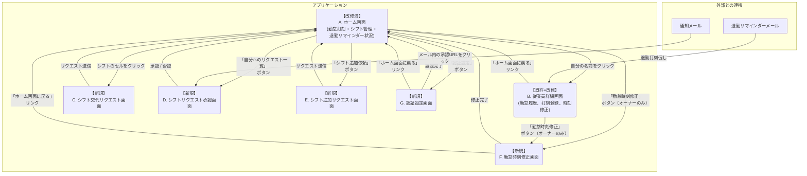

# 勤怠管理チェックアプリ仕様書

## 1. 概要

## 突発的なシフト交代が頻発する小規模飲食店を救う勤怠管理システム！

### 1.2. ターゲットユーザー

- ユーザー想定：学生が多く働いている居酒屋のオーナー・従業員
- グループLINEがあり、そこでシフト交代などの連携をとっている
    - シフト交代成立後は、オーナーが手動でシフト予定を書き換える

### 1.3 抱えている課題

1. 打刻忘れ
    1. 特に、急に入ったシフトの場合に打刻忘れが多い
        
        (繁忙期の「打刻は後でいいから先ドリンク持って行って」的なケース想定)
        
2. **退勤打刻忘れが特に多い**
    - 仕込みで延長することもあり、退勤時刻が不規則になりがち
    - 15分間隔でのリマインダーが必要
    
3. 突発的なシフト変更による、シフト表と実勤務時間の乖離
    1. 事前に決めていたシフトからの変更が多く、「今日のシフトは誰なのか」を確認するために、LINEを遡って正しい勤務時間を追跡する必要があり面倒
    
    → 従業員の遅刻時連絡や、打刻忘れの検知のために必要
    
4. **勤怠時刻修正の手間**
    - オーナーが勤怠時刻を修正するために、管理会社にメールする必要があり面倒
    
5. **認証の複雑さ**
    - パスワード+顔認証の二段階認証が面倒
    - パスワードのみで十分
    

### 1.3. 本アプリが生める価値

- メイン価値
    
    「突発的なシフト交代に対応できる勤怠管理システム」によって、シフト交代時に頻発する打刻忘れを防止、くわえてシフト表が実情を正しく反映できるようにし、スタッフ間での連携もとりやすくする
    
- サブ価値
    
    103万の壁を可視化することによって、計画的な勤務を促し年末の人手不足を解消
    
- **新たな価値**
    
    - 退勤打刻忘れの防止（15分間隔リマインダー）
    - オーナーによる直接的な勤怠時刻修正
    - パスワードのみの簡易認証
    

---

## 2. 画面構成

[画面構成と画面遷移図](./screen-design.md)

| 画面名 | 役割 | 備考 |
| --- | --- | --- |
| ホーム画面 | 従業員一覧とシフト表、
各従業員の「103万の壁ゲージ」と退勤リマインダー状況を表示する。 | 既存画面を改修 |
| 勤怠登録画面 | 個人の詳細な勤怠履歴を表示し、打刻を行う。 | 既存画面を改修 |
| シフト交代リクエスト画面 | 従業員がシフト交代のリクエストを作成・送信する。 | 新規作成 |
| シフト交代承認画面 | 従業員が自分宛のシフト交代リクエストを承認または否認する。 | 新規作成 |
| シフト追加依頼画面 | オーナーが従業員に新しいシフトの追加を依頼する。 | 新規作成 |
| 勤怠時刻修正画面 | オーナーが従業員の勤怠時刻を直接修正する。 | 新規作成 |
| 認証設定画面 | パスワードの設定と管理を行う。 | 新規作成 |

---

## 3. 機能仕様

### 3.1. シフト変更機能

従業員間でシフトの交代依頼・承認を行い、スプレッドシート上のシフト表を自動で更新する。

- **リクエストフロー**:
    - `シフト管理画面`から`シフト交代リクエスト画面`へ遷移する。
    - 交代したいシフトの日時、交代を依頼したい相手を選択し、リクエストを送信する。
- **承認フロー**:
    - `シフト管理画面`の「自分へのリクエスト一覧」またはシステムからの通知メール経由で`シフト交代承認画面`へアクセスする。
    - 承認/否認URLは、操作者を識別する`empId`とリクエストを特定する`requestId`をクエリパラメータに含む形式とする。（例: `/exec?empId=...&requestId=...`）
- **ステータス定義**:
    - `承認`: 依頼された誰かが承認した状態。
    - `否認`: 依頼された全員に承認されず、承認待ちが0人になった状態。
- **メール通知**:
    - リクエスト送信時、対象者にメールで通知する。
    - メール本文には「申請者名」と「対象シフト日時」を記載する。

### 3.1.1. シフト追加機能（新規追加）

オーナーが従業員に新しいシフトの追加を依頼し、従業員が承認・否認を行う機能。

**※権限**: オーナーのみがシフト追加依頼を発行できます。

- **リクエストフロー**:
    - オーナーが`シフト追加依頼画面`で従業員、日付、時間を選択してリクエストを送信する。
    - 依頼相手のスケジュール重複チェックが自動で行われる。
- **承認フロー**:
    - 依頼された従業員は「自分へのリクエスト一覧」または通知メール経由で承認・否認を行う。
    - 承認された場合、シフト表に自動で追加される。
- **ステータス定義**:
    - `申請中`: 依頼された従業員がまだ承認・否認していない状態。
    - `承認済み`: 依頼された従業員が承認した状態。
    - `否認済み`: 依頼された従業員が否認した状態。
- **メール通知**:
    - リクエスト送信時、依頼された従業員に「【シフト追加のお願い】」メールで通知する。
    - 承認・否認時、オーナーに結果を通知する。
- **重複チェック**:
    - 依頼された従業員が指定時間に既にシフトが入っている場合はエラーとなる。

### 3.2. 打刻忘れアラート機能

- **仕様**: スプレッドシート上のシフト予定時刻とfreee上での打刻状況を比較し、打刻忘れを検知して通知する。
- **出勤打刻アラート**: シフト予定開始時刻から5分経過しても出勤打刻がない場合、対象従業員にメールで通知する。
- **退勤打刻リマインダー**: 退勤予定時刻から15分間隔で退勤打刻が完了していない場合、対象従業員にメールで通知する。
- **ロジック**: スプレッドシートのシフト予定と、freee APIから取得した勤怠実績を定期的に比較して検知する。
- **備考**: バックグラウンド処理のため、専用画面は設けない。

### 3.3. 勤怠時刻修正機能（新規追加）

- **仕様**: オーナーが従業員の勤怠時刻を直接修正できる機能
- **対象**: オーナー権限を持つユーザーのみ
- **修正可能項目**: 出勤時刻、退勤時刻、休憩時間
- **修正履歴**: 修正内容と修正者、修正日時を記録
- **freee連携**: 修正後、freeeの勤怠データも自動更新

**※権限**: オーナーのみが勤怠時刻の修正を行えます。

### 3.4. 認証簡易化機能（新規追加）

- **仕様**: 二段階認証（パスワード+顔認証）を廃止し、パスワードのみでログイン
- **セキュリティ**: 強固なパスワードポリシー、bcrypt等によるハッシュ化
- **利便性**: シンプルで高速なログイン実現

### 3.5. 権限管理機能（新規追加）

本アプリケーションでは、以下の2つの権限レベルを設定しています。

- **従業員権限**: 基本的な勤怠管理機能を利用可能
- **オーナー権限**: 従業員権限に加え、管理機能を利用可能

#### 3.5.1. 権限別利用可能機能

| 機能 | 従業員 | オーナー | 備考 |
|------|--------|----------|------|
| 勤怠打刻 | ○ | ○ | 全従業員が利用可能 |
| シフト交代リクエスト | ○ | ○ | 全従業員が利用可能 |
| シフト交代承認 | ○ | ○ | 全従業員が利用可能 |
| シフト追加依頼 | × | ○ | オーナーのみ利用可能 |
| 勤怠時刻修正 | × | ○ | オーナーのみ利用可能 |
| 認証設定 | ○ | ○ | 全従業員が利用可能 |
| 103万の壁ゲージ表示 | ○ | ○ | 全従業員が利用可能 |

#### 3.5.2. 権限判定方法

- **オーナー判定**: 従業員名が「店長 太郎」の場合
- **従業員判定**: オーナー以外の全従業員

### 3.6. 103万の壁ゲージ機能

- **仕様**: 年間給与の見込み額を算出し、103万円に対する達成度合いをゲージで可視化する。
- **表示場所**:
    - `ホーム画面`: 全従業員のゲージを簡易的に一覧表示する。
    - `従業員詳細画面`: 個人のゲージをより詳細に（金額表示付きなどで）表示する。
- **計算ロジック**:
    - **時給データ**: freee人事労務API(`GET /api/v1/employees/{id}`)から取得できる`base_pay`を時給として利用する。
    - **実績データ**: freee人事労務APIを利用し、過去の勤怠実績または給与明細を取得して計算に利用する。

---

## 4. データ構造（Googleスプレッドシート）

### 4.1. シフト表シート

| 2025年8月 |  |  |  |  |  |
| --- | --- | --- | --- | --- | --- |
| 従業員ID | **従業員名** | **1** | **2** | **3** | ... |
| 101 | テスト太郎 | 18-20 | 18-20 |  | ... |
| 102 | テスト次郎 | 20-24 |  | 18-20 | ... |

### 4.2. シフト交代管理シート

| **申請ID** | **申請者ID** | **承認者ID** | **対象シフト開始日時** | **対象シフト終了日時** | **ステータス** |
| --- | --- | --- | --- | --- | --- |
| (UUIDなど) | (freeeのempId) | (freeeのempId) | (YYYY-MM-DD HH:MM) | (YYYY-MM-DD HH:MM) | (申請中/承認/否認) |

### 4.2.1. シフト追加管理シート（新規追加）

| **申請ID** | **依頼対象従業員ID** | **対象シフト開始日時** | **対象シフト終了日時** | **ステータス** |
| --- | --- | --- | --- | --- |
| (UUIDなど) | (freeeのempId) | (YYYY-MM-DD HH:MM) | (YYYY-MM-DD HH:MM) | (申請中/承認済み/否認済み) |

### 4.3. 勤怠時刻修正履歴シート（新規追加）

| **修正ID** | **対象従業員ID** | **修正者ID** | **修正日時** | **修正項目** | **修正前** | **修正後** | **修正理由** |
| --- | --- | --- | --- | --- | --- | --- | --- |
| (UUIDなど) | (freeeのempId) | (freeeのempId) | (YYYY-MM-DD HH:MM) | (出勤/退勤/休憩) | (修正前の値) | (修正後の値) | (テキスト) |

### 4.4. 打刻忘れアラート管理シート（新規追加）

| **従業員ID** | **シフト開始時刻** | **シフト終了時刻** | **出勤打刻状況** | **退勤打刻状況** | **最終アラート送信時刻** | **アラート回数** | **最終更新日時** |
| --- | --- | --- | --- | --- | --- | --- | --- |
| (freeeのempId) | (YYYY-MM-DD HH:MM) | (YYYY-MM-DD HH:MM) | (未打刻/打刻済) | (未打刻/打刻済) | (YYYY-MM-DD HH:MM) | (数値) | (YYYY-MM-DD HH:MM) |

### 4.5. 認証設定シート（新規追加）

| **従業員ID** | **ハッシュ化パスワード** | **パスワード最終更新日時** | **最終ログイン日時** |
| --- | --- | --- | --- |
| (freeeのempId) | (bcrypt等でハッシュ化) | (YYYY-MM-DD HH:MM) | (YYYY-MM-DD HH:MM) |

## 今後の展望

### 103万の壁ゲージの実装

この3日間では実装ができなかったので、ブラッシュアップ期間で完成させたい

### LINE連携

シフト交代をLINEからできるようにする
⇒ 既存の体験を維持したまま、このシステムの恩恵を受けることが可能に

### 欠勤の登録

病欠などで急遽休むこともあるはずなので、「欠勤登録(シフト取り消し)」ができたらいいかもしれない