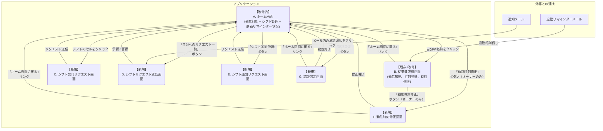

# 画面構成と画面遷移図

### 必要な画面構成

既存の2画面に、主にシフト管理機能と新機能を実現するための新規画面を加えた、計6画面で構成します。

1. **【既存＋改修】ホーム画面（従業員一覧）**
    - 役割：アプリケーションの入口。オーナーが全従業員の状況を俯瞰する。
    - **追加機能**
        - 全従業員のシフトをカレンダー形式などで一覧表示する。ここを起点にシフト交代のリクエストや確認を行います。
        - 従業員一覧に、それぞれの「**103万の壁ゲージ**」を表示し、進捗を一覧で比較できるようにします。
        - **退勤打刻リマインダー状況**を表示（未打刻者のハイライト表示）
2. **【既存＋改修】従業員詳細画面**
    - 役割：個々の従業員の詳細な情報を確認する。
    - **表示機能：** ホーム画面よりも大きなサイズで、より詳細な「**103万の壁ゲージ**」（例：具体的な金額表示など）を表示します。
    - **追加機能**: 勤怠時刻の修正機能（オーナーのみ）
3. **【新規】シフト交代リクエスト画面**
    - 役割：従業員が交代してほしい自分のシフトと、交代を依頼したい相手（もしくは全員）を選択し、リクエストを送信する。
4. **【新規】シフト交代承認画面**
    - 役割：自分に来ているシフト交代リクエストを確認し、「承認」または「否認」を行う。
5. **【新規】勤怠時刻修正画面**
    - 役割：オーナーが従業員の勤怠時刻を直接修正する。
    - **機能**: 出勤時刻、退勤時刻、休憩時間の修正、修正履歴の表示
6. **【新規】認証設定画面**
    - 役割：パスワードの設定と管理を行う。
    - **機能**: パスワードの変更、セキュリティ設定

※「打刻忘れアラート機能」（出勤打刻アラート + 退勤打刻リマインダー）は、バックエンドで自動実行されるメール通知機能のため、専用画面は不要です。

### 画面遷移図

### 画面遷移の詳細説明

**起動〜詳細確認**

アプリケーションにアクセスすると、まず**A. ホーム画面**が表示されます。ここには、勤怠打刻用の従業員一覧と、シフト管理用のカレンダー、退勤打刻リマインダーの状況が表示されます。
従業員一覧の任意の名前をクリックすると、その従業員の**B. 従業員詳細画面**に遷移します。この画面では、その従業員の勤怠履歴を確認し、手動で打刻情報を登録できます。

**シフト関連機能へのアクセス**

シフト関連の機能はすべて**A. ホーム画面**からアクセスします。

- シフト交代を依頼したい場合は、シフト表上の任意のシフトをクリックすることで、**C. シフト交代リクエスト画面**に直接遷移します。
- 交代依頼やシフト追加依頼の承認・否認を行う場合は、**「自分へのリクエスト一覧」ボタン**をクリックすることで、**D. シフトリクエスト承認画面**に遷移します。
- 管理者（オーナー）が従業員にシフト追加を依頼する場合は、**「シフト追加依頼」ボタン**をクリックすることで、**E. シフト追加リクエスト画面**に遷移します。

**新機能へのアクセス**

- **勤怠時刻修正**: オーナー権限を持つユーザーは、**A. ホーム画面**または**B. 従業員詳細画面**から**「勤怠時刻修正」ボタン**をクリックして**F. 勤怠時刻修正画面**に遷移できます。
- **認証設定**: 全ユーザーは**A. ホーム画面**から**「認証設定」ボタン**をクリックして**G. 認証設定画面**に遷移できます。パスワードの変更やセキュリティ設定を行えます。

**シフト交代のリクエストフロー**

**A. ホーム画面**でシフト表上の任意のシフトをクリックすると、**C. シフト交代リクエスト画面**に移ります。
この画面で、交代したいシフトの日時と依頼相手を選択して「送信」すると、システムは相手の従業員に通知を行い、画面はもとの**A. ホーム画面**に戻ります。

**シフトの承認・否認フロー**

交代や追加を依頼された従業員は、**A. ホーム画面**から**「自分へのリクエスト一覧」ボタン**をクリックするか、システムから送信された通知メール内のURLをクリックして、D. シフトリクエスト承認画面へアクセスします。
この画面で「承認」または「否認」を行うと、結果がシステムに反映され、画面は**A. ホーム画面**に戻ります。承認された場合、スプレッドシート上のシフト表が自動的に更新されます。

**打刻忘れアラート機能（出勤 + 退勤）**

- **出勤打刻アラート**: シフト予定開始時刻から5分経過しても出勤打刻がない場合、対象従業員にメール通知が送信されます。
- **退勤打刻リマインダー**: 退勤予定時刻から15分間隔で、退勤打刻が完了していない従業員にメール通知が送信されます。

これらの機能はバックグラウンドで動作し、専用画面はありません。従業員は通知メールのリンクから**B. 従業員詳細画面**にアクセスして打刻を行うことができます。