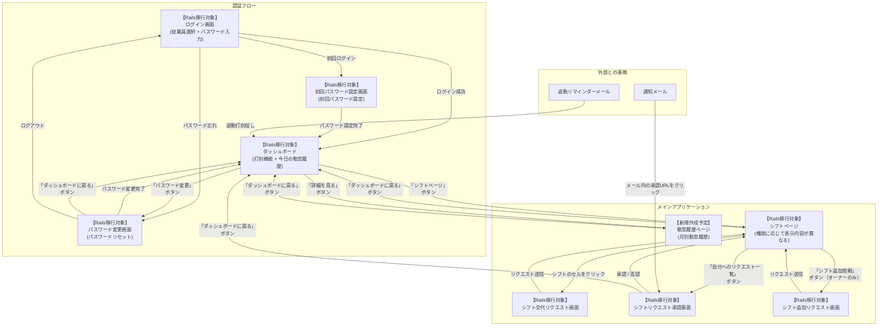

# 画面構成と画面遷移図（Rails版）

### Rails移行対象画面構成

認証機能とシフト管理機能を実現するための画面構成です。**ユーザーから見た画面遷移やUIは既存のまま維持**し、バックエンドのみRailsに移行します。

1. **【Rails移行対象】ログイン画面**
    - 役割：アプリケーションの入口。従業員の認証を行う。
    - **機能**: 従業員選択、パスワード入力、初回ログイン時のパスワード設定誘導
2. **【Rails移行対象】ダッシュボード**
    - 役割：認証後のメイン画面。打刻機能に特化したシンプルなインターフェース。
    - **機能**: 個人の打刻機能、今日の勤怠履歴表示、クイックアクセス
3. **【Rails移行対象】シフトページ**
    - 役割：シフト関連の機能を表示。権限に応じて表示内容が異なる。
    - **機能**: 権限別表示制御、シフト表、103万の壁ゲージ、リクエスト一覧、給与一覧機能
4. **【新規作成予定】勤怠履歴ページ**
    - 役割：詳細な月別勤怠履歴の確認。
    - **機能**: 月別勤怠履歴テーブル、月間サマリー、月次ナビゲーション
5. **【Rails移行対象】シフト交代リクエスト画面**
    - 役割：従業員が交代してほしい自分のシフトと、交代を依頼したい相手（もしくは全員）を選択し、リクエストを送信する。
6. **【Rails移行対象】シフト交代承認画面**
    - 役割：自分に来ているシフト交代リクエストを確認し、「承認」または「否認」を行う。
7. **【Rails移行対象】パスワード変更画面**
    - 役割：パスワードの変更と管理を行う。
    - **機能**: パスワードの変更、ログアウト機能
8. **【Rails移行対象】初回パスワード設定画面**
    - 役割：初回ログイン時のパスワード設定を行う。
    - **機能**: 初回パスワード設定

※「打刻忘れアラート機能」（出勤打刻アラート + 退勤打刻リマインダー）は、Rails + Sidekiqでバックグラウンド実行されるメール通知機能のため、専用画面は不要です。

### Rails移行後の技術構成

- **フロントエンド**: 既存のHTML/CSS/JavaScript（UI変更なし）
- **バックエンド**: Ruby on Rails 8.0.2
- **データベース**: SQLite（全環境統一）
- **バックグラウンド処理**: Sidekiq + Redis
- **デプロイ**: Fly.io（無料枠対応）

### 画面遷移図

### 画面遷移の詳細説明

**認証フロー**

アプリケーションにアクセスすると、まず**ログイン画面**が表示されます。従業員を選択し、パスワードを入力してログインします。
初回ログインの場合は、**初回パスワード設定画面**でパスワードを設定してから、**ダッシュボード**に遷移します。
パスワードを忘れた場合は、**パスワード変更画面**でパスワードをリセットできます。

**メインアプリケーション**

ログインが完了すると、**ダッシュボード**が表示されます。ここには、打刻機能に特化したシンプルなインターフェースと今日の勤怠履歴が表示されます。

**シフト関連機能へのアクセス**

シフト関連の機能は**シフトページ**からアクセスします。

- **シフトページ**では、権限に応じて表示内容が異なります：
  - 従業員：自分の103万の壁ゲージ、シフト表、自分へのリクエスト一覧（自動表示）
  - オーナー：全従業員の給与状況（103万の壁ゲージ）、シフト表、自分へのリクエスト一覧（自動表示）、シフト追加依頼ボタン
- シフト交代を依頼したい場合は、シフト表上の任意のシフトをクリックすることで、**シフト交代リクエスト画面**に直接遷移します。
- 交代依頼やシフト追加依頼の承認・否認を行う場合は、**「自分へのリクエスト一覧」ボタン**をクリックすることで、**シフトリクエスト承認画面**に遷移します。

**認証・管理機能へのアクセス**

- **パスワード変更**: 全ユーザーは**ダッシュボード**から**「パスワード変更」ボタン**をクリックして**パスワード変更画面**に遷移できます。パスワードの変更を行えます。
- **勤怠履歴**: 詳細な月別勤怠履歴を確認したい場合は、**ダッシュボード**から**「詳細を見る」ボタン**をクリックして**勤怠履歴ページ**に遷移できます。

**シフト交代のリクエストフロー**

**シフトページ**でシフト表上の任意のシフトをクリックすると、**シフト交代リクエスト画面**に移ります。
この画面で、交代したいシフトの日時と依頼相手を選択して「送信」すると、システムは相手の従業員に通知を行い、画面はもとの**シフトページ**に戻ります。

**シフトの承認・否認フロー**

交代や追加を依頼された従業員は、**シフトページ**から**「自分へのリクエスト一覧」ボタン**をクリックするか、システムから送信された通知メール内のURLをクリックして、**シフトリクエスト承認画面**へアクセスします。
この画面で「承認」または「否認」を行うと、結果がシステムに反映され、画面は**シフトページ**に戻ります。承認された場合、スプレッドシート上のシフト表が自動的に更新されます。

**打刻忘れアラート機能（出勤 + 退勤）**

- **出勤打刻アラート**: シフト予定開始時刻から5分経過しても出勤打刻がない場合、対象従業員にメール通知が送信されます。
- **退勤打刻リマインダー**: 退勤予定時刻から15分間隔で、退勤打刻が完了していない従業員にメール通知が送信されます。

これらの機能はバックグラウンドで動作し、専用画面はありません。従業員は通知メールのリンクから**ダッシュボード**にアクセスして打刻を行うことができます。